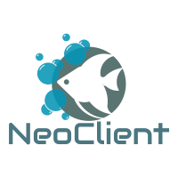

# NeoClient
 
[](#contributing)
[](https://www.nuget.org/packages/NeoClient/)

A Lightweight and simple object graph mapper (OGM) for [Neo4j](https://neo4j.com) which support transactions and BOLT protocol.

## :package: Installation
NeoClient is available on [NuGet](https://www.nuget.org/packages/NeoClient/). 

```sh
dotnet add package NeoClient
```

## 🚀 Usage

### Creating Database Connection
Optional you can pass authentication credential via the constructor.
```csharp
INeoClient client = new NeoClient(
    uri: "bolt://localhost:7687", 
    userName: "user", //optional
    password: "password", //optional
    config: Config.Builder //optional
        .WithMaxConnectionLifetime(TimeSpan.FromMinutes(30))
        .WithMaxConnectionPoolSize(100)
        .WithConnectionAcquisitionTimeout(TimeSpan.FromMinutes(2))
        .WithEncryptionLevel(EncryptionLevel.None)
        .ToConfig() 
    strip_hyphens: true //optional, default is false
);
client.Connect();
```

For example, if you were using any IoC container, you could register the client like so:
```csharp
container.Register<INeoClient>((c, p) =>
{
    INeoClient client = new NeoClient(
        uri: "bolt://localhost:7687", 
        ...
        );
    client.Connect();
    return client;
});
```
### User Node Model
```csharp
 public class User : EntityBase
 {
     public User() : base(label: "User") { }
     
     public string FirstName { get; set; }
     public string LastName { get; set; }
     public string Email { get; set; }
 }
```

### Creating a Node
```csharp
User entity = client.Add(new User { Email = "kir.oktay@gmail.com", FirstName = "Oktay", LastName = "Kir" });
```

### Adding a Label to a Node
```csharp
bool result = client.AddLabel(
    uuid: "01a68df3-cc35-4eb0-a199-0d924da86eab",
    labelName: @"LabelName"
);
```

### Retrieving a Node by Id
```csharp
User node = client.GetByUuidWithRelatedNodes<User>("01a68df3-cc35-4eb0-a199-0d924da86eab");
```

### Retrieving All Nodes
```csharp
IList<User> nodes = client.GetAll<User>();
```

### Retrieving Nodes by Single Property
```csharp
IList<User> nodes = client.GetByProperty<User>("Email", "kir.oktay@gmail.com");
```

### Retrieving Nodes by Multiple Properties
```csharp
var properties = new Dictionary<string, object>(){
	{ nameof(User.Name), "keanu"},
};

IList<User> nodes = client.GetByProperties<User>(properties);
```

### Updating a Node
```csharp
User updatedNode = client.Update(
    entity: node,
    uuid: "01a68df3-cc35-4eb0-a199-0d924da86eab",
    fetchResult: true //optional, default is false
);
```

### Deleting a Node (Soft Delete)
```csharp
User node = client.Delete<User>("01a68df3-cc35-4eb0-a199-0d924da86eab");
```

### Dropping a Node by Id
```csharp
bool result = client.Drop<User>("01a68df3-cc35-4eb0-a199-0d924da86eab");
```

### Drop Nodes by Properties
```csharp
int nodesDeleted = client.DropByProperties<User>(
    props: new Dictionary<string, object>(){
        { nameof(User.Name), "keanu"},
    }
);
```

### Create a Relationship Between Certain Two Nodes
```csharp
bool isCreated = client.CreateRelationship(
    uuidFrom: "2ac55031-3089-453a-a858-e1a9a8b68a16",
    uuidTo: "ac43523a-a15e-4d25-876e-e2a2cc4de125",
    relationshipAttribute: new RelationshipAttribute{
        Direction = DIRECTION.INCOMING,
        Name = "FAMILY"
    },
    props: new Dictionary<string, object>(){ //optional
        {"CreatedAt", DateTime.UtcNow},
        {"Kinship_Level", 1},
	    {"Name", "FakeName"}
    }
);
```

### Dropping a Relationship Between Certain Two Nodes 
```csharp
bool result = client.DropRelationshipBetweenTwoNodes(
    uuidFrom: "2ac55031-3089-453a-a858-e1a9a8b68a16",
    uuidTo: "ac43523a-a15e-4d25-876e-e2a2cc4de125",
    relationshipAttribute: node.GetRelationshipAttributes(ep => ep.roles).FirstOrDefault()
);
```

### Merge Nodes
Creating a node with its properties on creation time. If the nodes had already been found, different multiple properties would have been set.
```csharp
User node = client.Merge(
    entityOnCreate: new User(){ name = "keanu"; createdAt = DateTime.UtcNow.ToTimeStamp(); },
    entityOnUpdate: new User(){ name = "keanu"; updatedAt = DateTime.UtcNow.ToTimeStamp(); },
    where: "name:\"keanu\""
);
```

### Merge Relationships
```csharp
bool result = client.MergeRelationship(
    uuidFrom: "2ac55031-3089-453a-a858-e1a9a8b68a16",
    uuidTo: "ac43523a-a15e-4d25-876e-e2a2cc4de125",
    relationshipAttribute: node.GetRelationshipAttributes(ep => ep.roles).FirstOrDefault()
);
```

### Running Custom Cypher Query
#### Example 1:
```csharp
string cypherCreateQuery = @"CREATE (Neo:Crew {name:'Neo'}), 
    (Morpheus:Crew {name: 'Morpheus'}), 
    (Trinity:Crew {name: 'Trinity'}), 
    (Cypher:Crew:Matrix {name: 'Cypher'}), 
    (Smith:Matrix {name: 'Agent Smith'}), 
    (Architect:Matrix {name:'The Architect'}),
    (Neo)-[:KNOWS]->(Morpheus), 
    (Neo)-[:LOVES]->(Trinity), 
    (Morpheus)-[:KNOWS]->(Trinity),
    (Morpheus)-[:KNOWS]->(Cypher), 
    (Cypher)-[:KNOWS]->(Smith), 
    (Smith)-[:CODED_BY]->(Architect)";

IStatementResult result = client.RunCustomQuery(query: cypherQuery);

string cypherQuery = @"MATCH (n:Crew)-[r:KNOWS*]-(m) WHERE n.name='Neo' RETURN n AS Neo,r,m";

IStatementResult queryResult = client.RunCustomQuery(query: cypherQuery);
IList<object> result = queryResult.GetValues();
```
#### Example 2:
```csharp
string cypherQuery = @"MATCH (n:User) RETURN n";

IList<User> result = client.RunCustomQuery<User>(query: cypherQuery);
```
## Integration Tests
NeoClient has several tests that verify that its ability to use the system it integrates with correctly.

There's a [docker-compose](NeoClient.Tests/resources/docker-compose.yml) file and you can use the following command to launch Neo4j container for running the integration tests.
```
$ docker-compose up -d
```

## Transactions

## To Do
* ~~Nuget package~~ 
* ~~Integration Tests~~
* Supporting more functionalities
* Creating example projects

## 🤝 Contributing
1. Fork it ( https://github.com/OKTAYKIR/NeoClient/fork )
2. Create your feature branch (`git checkout -b my-new-feature`)
3. Commit your changes (`git commit -am 'Add some feature'`)
4. Push to the branch (`git push origin my-new-feature`)
5. Create a new Pull Request

## Show your support
Please ⭐️ this repository if this project helped you!

## 📝 License
MIT License
